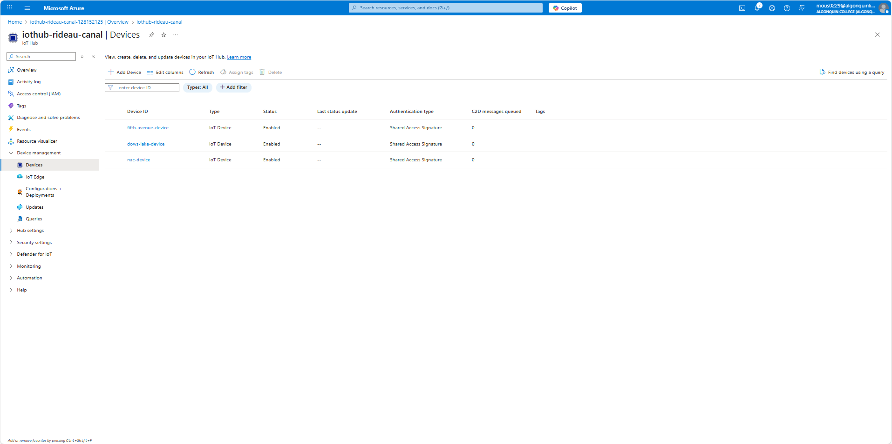
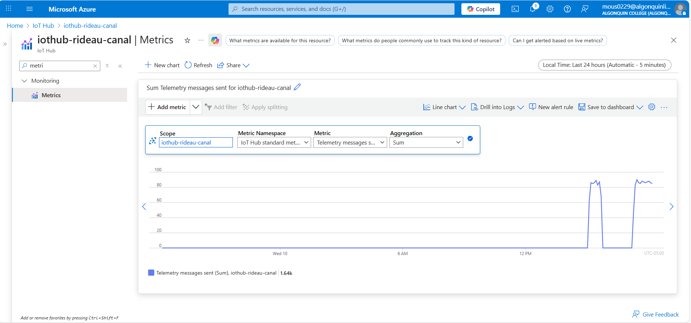
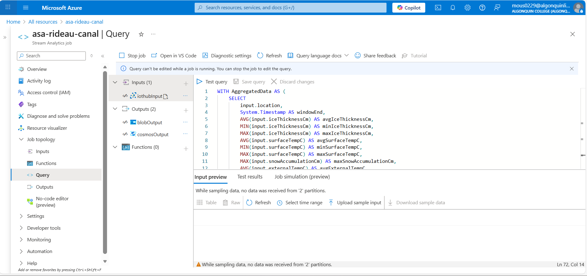
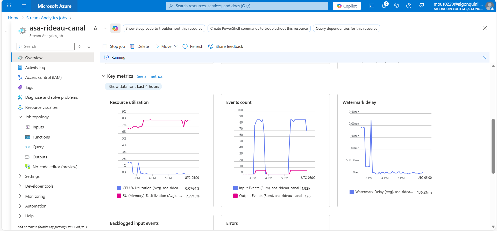
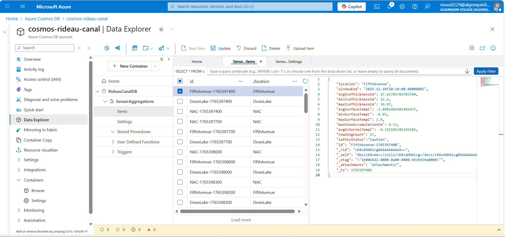
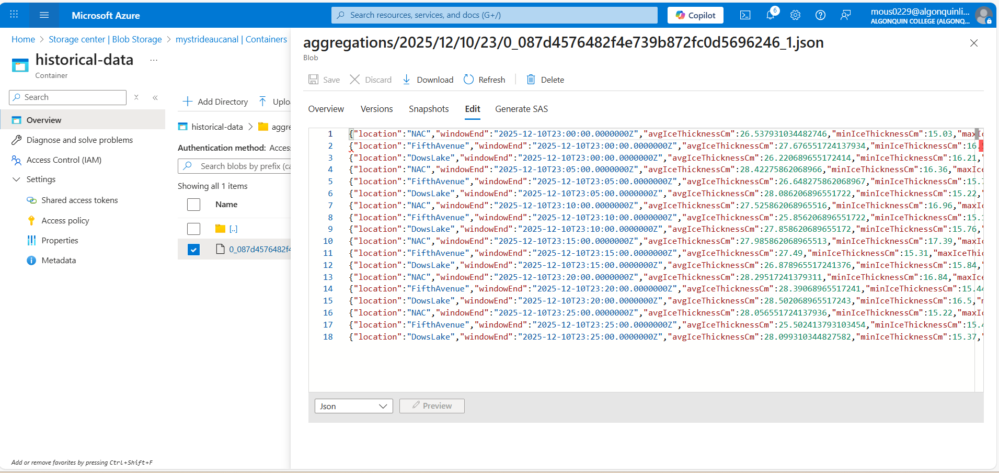
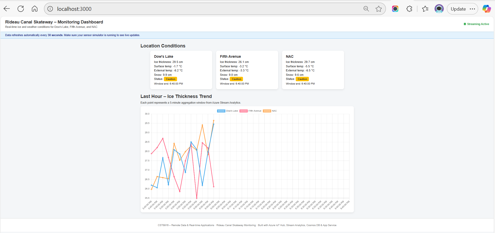
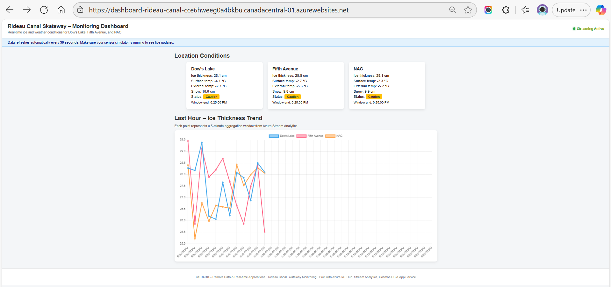

# Rideau Canal Skateway – Real-Time Monitoring System

A complete end-to-end **real-time cloud monitoring system** built with Azure services to track ice conditions, weather telemetry, and safety status across three Rideau Canal locations: **Dow’s Lake**, **Fifth Avenue**, and **NAC**.

This solution streams IoT sensor data into Azure, processes it in real-time, stores it efficiently, archives it historically, and visualizes it through a live web dashboard.

---

# 1. Student Information

**Name:** Soufiane Soufiane  
**Student ID:** 041182427  
**Course:** CST8916 – Remote Data and Real-time Applications  
**Term:** Fall 2025  

### Repository Links

- **Main Documentation Repository (this repo):**  
  https://github.com/SoufianeMouss/rideau-canal-monitoring

- **IoT Sensor Simulator:**  
  https://github.com/SoufianeMouss/rideau-canal-sensor-simulation

- **Web Dashboard:**  
  https://github.com/SoufianeMouss/rideau-canal-dashboard

---

# 2. Scenario Overview

## Problem Statement

The **Rideau Canal Skateway** requires continuous monitoring to determine whether ice conditions are **Safe**, **Caution**, or **Unsafe** for public use.  
The National Capital Commission (NCC) needs a **cloud-based real-time monitoring system** capable of:

- Receiving telemetry from IoT sensors at multiple locations  
- Processing and aggregating this data every 5 minutes  
- Classifying safety status  
- Storing and archiving data  
- Presenting real-time conditions through a web dashboard for operations staff  

## System Objectives

- Simulate IoT sensors generating ice and weather telemetry every **10 seconds**
- Ingest data using **Azure IoT Hub**
- Process streaming data using **Azure Stream Analytics** with **5-minute tumbling windows**
- Compute aggregates and safety classification
- Store processed data in **Azure Cosmos DB**
- Archive raw historical windows in **Azure Blob Storage**
- Visualize conditions on a live **Azure App Service dashboard**

---

# 3. System Architecture

### Architecture Diagram  
*(Located in `architecture/architecture-diagram.png`)*

```mermaid
flowchart TD
    A([Simulated IoT Devices<br/>DowsLake / FifthAvenue / NAC])
    A --> B([Azure IoT Hub])
    B --> C([Azure Stream Analytics<br/>5-min Tumbling Window])
    C --> D([Azure Cosmos DB<br/>Processed Aggregations])
    C --> E([Azure Blob Storage<br/>Historical Archive])
    D --> F([Azure App Service<br/>Web Dashboard])
````

---

## Data Flow Explanation

1. **Simulated IoT Devices**

   * Python-based simulator sends JSON telemetry every 10 seconds.

2. **Azure IoT Hub**

   * Acts as the device-to-cloud ingestion endpoint.

3. **Azure Stream Analytics**

   * Performs real-time aggregations:

     * AVG / MIN / MAX ice thickness
     * AVG / MIN / MAX surface temperature
     * MAX snow depth
     * AVG external temperature
     * COUNT of readings
   * Computes **Safety Status**:

     * **Safe:** ice ≥ 30 cm & surfaceTemp ≤ –2°C
     * **Caution:** ice ≥ 25 cm & surfaceTemp ≤ 0°C
     * **Unsafe:** otherwise
   * Outputs results to:

     * **Cosmos DB** (live dashboard)
     * **Blob Storage** (historical archive)

4. **Azure Cosmos DB**

   * Stores one document per location per 5-minute window
   * Partition Key: `/location`

5. **Azure Blob Storage**

   * Archives windowed JSON results for long-term access

6. **Azure App Service Dashboard**

   * Node.js API + HTML/JS frontend (Chart.js)
   * Shows current status, metrics, and last-hour chart

---

# 4. Implementation Overview

Below is a high-level summary of all the components.

---

### **4.1 IoT Sensor Simulation**

Repository: [https://github.com/SoufianeMouss/rideau-canal-sensor-simulation](https://github.com/SoufianeMouss/rideau-canal-sensor-simulation)

* Implemented in Python using Azure IoT Device SDK
* Sends telemetry every **10 seconds**
* Three simulated devices: Dow’s Lake, Fifth Avenue, NAC
* Uses `.env` for device connection strings

---

### **4.2 Azure IoT Hub Configuration**

* Three device identities created
* Connection strings used by the simulator
* IoT Hub serves as ingestion layer for Stream Analytics

---

### **4.3 Azure Stream Analytics Job**

**Input:** IoT Hub
**Outputs:** Cosmos DB + Blob Storage
**Window:** 5-minute tumbling window

### Stream Analytics Query

(Also stored in `stream-analytics/query.sql`)

```sql
SELECT
    location,
    System.Timestamp AS windowEnd,
    AVG(iceThicknessCm) AS avgIceThicknessCm,
    MIN(iceThicknessCm) AS minIceThicknessCm,
    MAX(iceThicknessCm) AS maxIceThicknessCm,
    AVG(surfaceTempC) AS avgSurfaceTempC,
    MIN(surfaceTempC) AS minSurfaceTempC,
    MAX(surfaceTempC) AS maxSurfaceTempC,
    MAX(snowAccumulationCm) AS maxSnowAccumulationCm,
    AVG(externalTempC) AS avgExternalTempC,
    COUNT(*) AS readingCount
INTO cosmosOutput
FROM iotInput TIMESTAMP BY timestamp
GROUP BY
    location,
    TumblingWindow(minute, 5);
```

---

### **4.4 Cosmos DB Setup**

* API: Core (SQL)
* Database: `RideauCanalDB`
* Container: `SensorAggregations`
* Partition Key: `/location`
* Document ID Format: `{location}-{timestamp}`
* Stores aggregated and classified results

---

### **4.5 Blob Storage Configuration**

* Container: `historical-data`
* Path structure: `aggregations/{date}/{time}.json`
* Stores historical windows

---

### **4.6 Web Dashboard**

Repository: [https://github.com/SoufianeMouss/rideau-canal-dashboard](https://github.com/SoufianeMouss/rideau-canal-dashboard)

* Backend: Node.js + Express
* Database SDK: `@azure/cosmos`
* Frontend: HTML, CSS, JS, Chart.js
* Features:

  * Real-time cards
  * Safety badges
  * Auto-refresh (30 seconds)
  * “Last Hour – Ice Thickness Trend” chart

---

### **4.7 Azure App Service Deployment**

* Runtime: Node.js LTS
* App Settings configured with:

  * COSMOS_ENDPOINT
  * COSMOS_KEY
  * COSMOS_DATABASE
  * COSMOS_CONTAINER
* Deploy via GitHub or VS Code
* Dashboard available publicly

---

# 5. Repository Links

* **Sensor Simulation:**
  [https://github.com/SoufianeMouss/rideau-canal-sensor-simulation](https://github.com/SoufianeMouss/rideau-canal-sensor-simulation)

* **Web Dashboard:**
  [https://github.com/SoufianeMouss/rideau-canal-dashboard](https://github.com/SoufianeMouss/rideau-canal-dashboard)

---

# 6. Setup Instructions

## Prerequisites

* Azure Subscription
* Python 3.10+
* Node.js 18+
* Git

---

## High-Level Setup Steps

1. **Clone all 3 repositories.**
2. **Create Azure resources:**

   * IoT Hub
   * Stream Analytics
   * Cosmos DB
   * Storage Account
   * App Service
3. **Configure Stream Analytics input & outputs.**
4. **Start the Stream Analytics job.**
5. **Run the sensor simulator locally.**
6. **Run dashboard locally OR deploy to App Service.**
7. **Verify pipeline end-to-end.**

---

## Detailed Setup Guides

* Sensor Simulator Setup →
  [https://github.com/SoufianeMouss/rideau-canal-sensor-simulation](https://github.com/SoufianeMouss/rideau-canal-sensor-simulation)

* Dashboard Setup →
  [https://github.com/SoufianeMouss/rideau-canal-dashboard](https://github.com/SoufianeMouss/rideau-canal-dashboard)

---

# 7. Results and Analysis

### Sample Outputs

*(Screenshots stored in `/screenshots`)*

#### **1. IoT Hub – Device List**  
Shows the three registered devices (DowsLake, FifthAvenue, NAC).



---

#### **2. IoT Hub – Message Metrics**  
Confirms telemetry is being received in real time.



---

#### **3. Stream Analytics – Query**  
The query used to aggregate and classify sensor data.



---

#### **4. Stream Analytics – Running Job**  
Verifies that the job is active and connected to inputs and outputs.



---

#### **5. Cosmos DB – Aggregated Documents**  
Processed 5-minute window documents stored in Cosmos DB.



---

#### **6. Blob Storage – Historical Archive**  
Windowed JSON output files stored for long-term retention.



---

#### **7. Web Dashboard – Local Version**  
Dashboard running locally with condition cards and trend chart.



---

#### **8. Web Dashboard – Azure Deployed Version**  
Dashboard running on Azure App Service.



### Data Analysis

* Ice thickness shows natural variation between 25–31 cm depending on random simulation.
* Safety classification responds accurately to changes in ice and temperature metrics.
* Dashboard reliably reflects new data within each refresh cycle.

### System Performance Observations

* Stream Analytics processes windows consistently with < 1 second latency.
* Cosmos DB provides very fast read performance for dashboard API.
* Blob Storage archival successfully writes windowed JSON files.
* App Service dashboard loads quickly and consistently.

---

# 8. Challenges and Solutions

### Challenge 1: `safetyStatus` displaying `[object Object]`

**Cause:** Nested object stored in Cosmos DB.
**Solution:** Normalize value in backend or recalc status on front-end.

### Challenge 2: Stream Analytics schema mismatch

**Solution:** Remove unsupported `FORMAT()` usage and ensure correct field types.

### Challenge 3: Git Bash PATH issues inside VS Code

**Solution:** Switch to PowerShell for local development.

---

# 9. AI Tools Disclosure

**Tools Used:** ChatGPT
**Purpose:**

* Assist with README drafting
* Suggest code patterns
* Debug technical issues

**Extent:**

* All code and configurations were fully reviewed and tested by me
* I understand every component and its purpose

---

# 10. References

* Azure Documentation
* Chart.js
* Node.js / Express
* Python Azure IoT SDK
